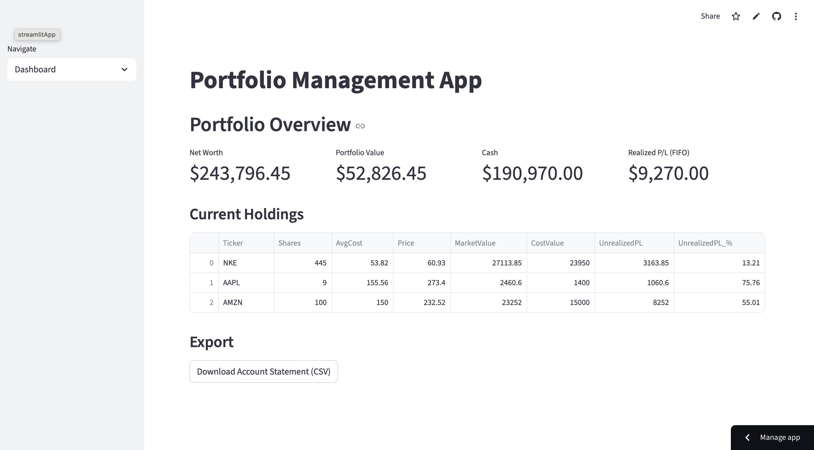
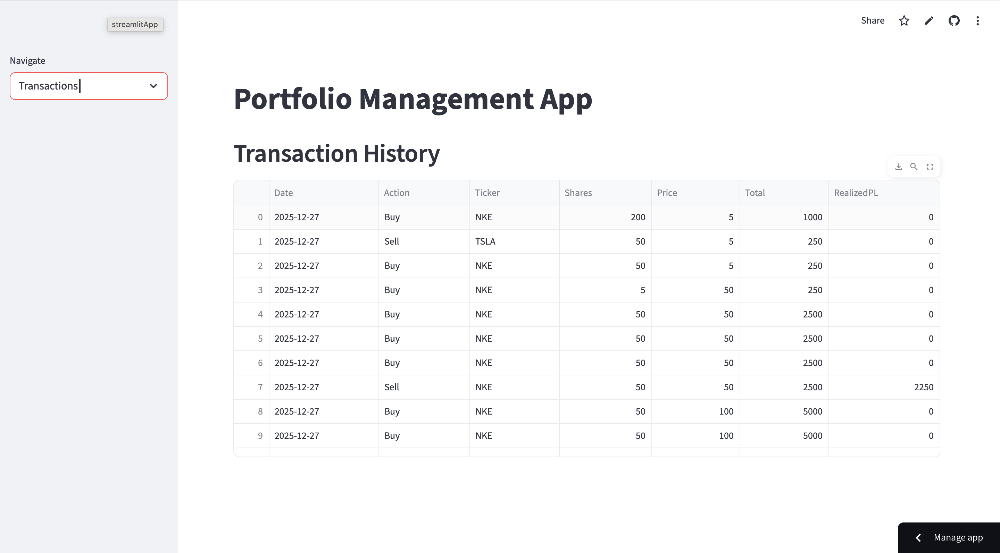
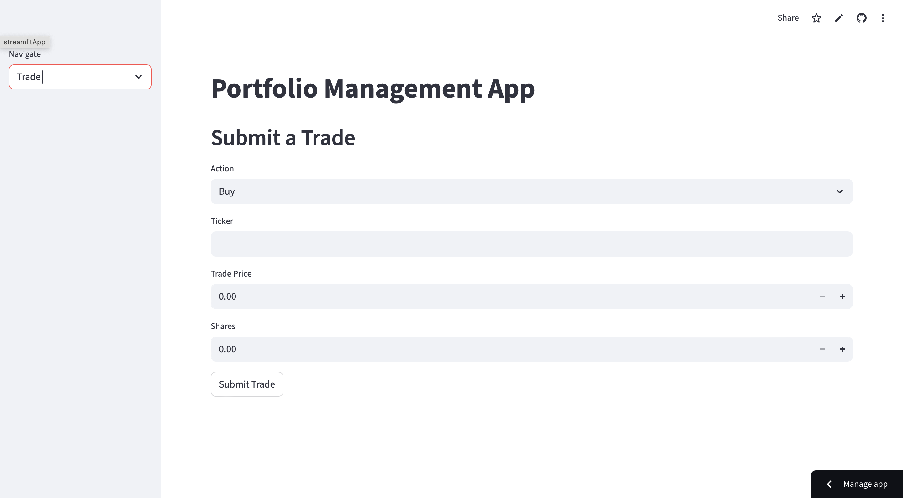
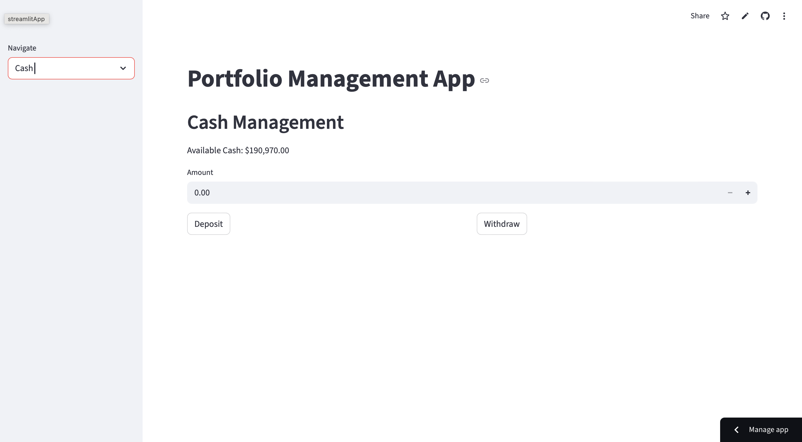
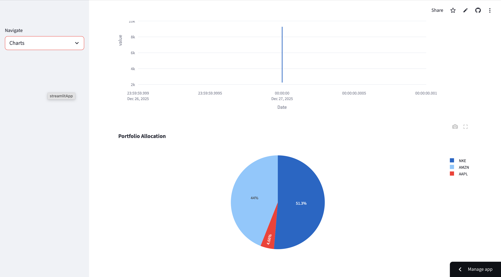

## Portfolio Management & Tracking App

This project is a Python and Streamlit-based portfolio tracker for managing stock holdings, tracking performance over time, monitoring cash balances, and visualizing changes in portfolio value. The application uses yfinance to pull real-time market data and stores activity in CSV files, allowing the portfolio state to persist across sessions.

## Live App Demo
https://portfolio-management-app-mmaxtaylor2.streamlit.app

## Screenshots

### Dashboard

### Portfolio Overview / Positions

### Trade Entry

### Cash Management

### Performance Charts

## Features:

Add, edit, and delete stock holdings
Real-time quote updates through yfinance
Track buy/sell transactions and cost basis
Store portfolio value history over time
Maintain a cash ledger and current cash balance
CSV-based data storage (no database required)
Streamlit user interface with multiple pages

## File Structure

portfolio-management-app/
├── app.py # Main Streamlit application
├── portfolio.csv # Active positions and quantities
├── transactions.csv # Buy/sell trade records
├── value_history.csv # Portfolio value logged over time
├── cash_balance.csv # Current cash on hand
├── cash_ledger.csv # Cash movement history
├── requirements.txt # Dependencies (streamlit, yfinance, pandas, plotly)
└── README.md # Documentation

## Local Installation and Running:

Clone the repository:

git clone https://github.com/mmaxtaylor2/portfolio-management-app.git
cd portfolio-management-app

Install dependencies:

pip install -r requirements.txt

Run the Streamlit application:

streamlit run app.py

Deployment (Streamlit Cloud):

Go to: https://share.streamlit.io/
Connect your GitHub account
Select the repository: mmaxtaylor2/portfolio-management-app
Choose branch: main
Choose file to run: app.py
Deploy the application
